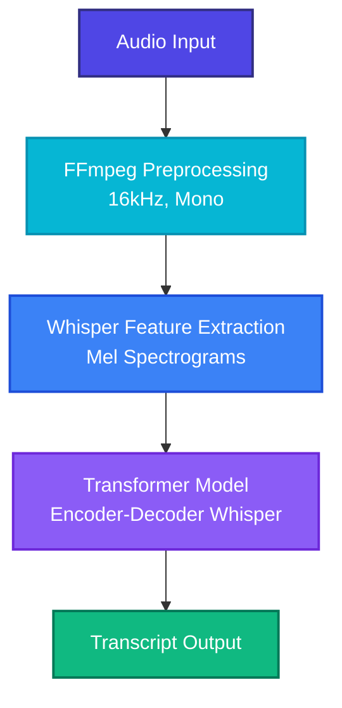

# 🎙️ STT Multilingual Model

A multilingual Speech-to-Text (STT) learning project using OpenAI Whisper, focused on audio preprocessing, transcription, dataset preparation, and beginner fine-tuning workflows for Tamil and English speech recognition.

---

## ✨ Features

- 🌐 **Tamil & English Support**: Multilingual speech recognition with excellent transcription accuracy.
- ⚙️ **Audio Preprocessing**: Automatic conversion of audio files using FFmpeg and Pydub.
- 📊 **Dataset Preparation**: Comprehensive Hugging Face dataset creation and loading.
- ⏱️ **Timestamp-based Outputs**: Segment-level timestamps for easy subtitle generation or tracking.
- 🧠 **Beginner-Friendly ML Pipelines**: Built for clarity and ease of learning.

---

## 🛠️ Technologies & Dependencies

- **Python** (Core logic and environment)
- **Faster Whisper** (High-efficiency inference engine)
- **Transformers** & **Torch** (Deep Learning framework)
- **Hugging Face Datasets** (Dataset organization)
- **FFmpeg & Pydub** (Audio conversion and processing)
- **Librosa** (Audio feature extraction)

---

## 📂 Project Structure

```text
STT/
│
├── audio/                   # Raw input audio files
│
├── dataset/
│   ├── audio/              # Normalized, preprocessed audio files (16kHz, mono)
│   │   ├── 001_clean.wav
│   │   ├── 002_clean.wav
│   │   └── 003_clean.wav
│   └── metadata.csv         # CSV mapping filenames to transcript text
│
├── transcripts/             # Output transcription results
│   └── output.txt           # Saved full transcription output text
│
├── app.py                   # Speech-to-text inference script using Faster Whisper
├── clean.py                 # Audio preprocessing and normalization script (via Pydub)
├── dataset.py               # Hugging Face dataset loading and verification script
├── feature.py               # Log-Mel spectrogram audio feature extraction verification
├── prepare.py               # Complete Hugging Face dataset-wide mapping pipeline script
├── processor.py             # Pretrained WhisperProcessor instantiation validation
├── tokenTest.py             # Whisper text tokenization and token ID verification
├── training.py              # Individual training sample constructor verification
│
├── requirements.txt         # Project package dependencies
├── README.md                # Documentation (this file)
└── .gitignore               # Version control ignore lists
```

---

## ⚙️ Setup & Installation

### 📋 Prerequisites

| Tool | Purpose |
| :--- | :--- |
| **Python 3.11+** | Main programming language |
| **Git** | Version control |
| **FFmpeg** | Audio processing and format conversions |
| **VS Code** | Recommended IDE / Code Editor |

---

### 📥 Step-by-Step Installation

#### 1. Python Installation
1. Download Python from the [Official Downloads Page](https://www.python.org/downloads/).
2. Install **Python 3.11** or above.
3. > [!IMPORTANT]
   > During installation, make sure to check the box for **"Add Python to PATH"**.
4. Verify the installation in your terminal:
   ```bash
   python --version
   # Expected Output: Python 3.11.x (or higher)
   ```

#### 2. Git Installation
1. Download Git from [Git Downloads](https://git-scm.com/downloads).
2. Install with default settings.
3. Verify the installation:
   ```bash
   git --version
   ```

#### 3. FFmpeg Installation (Required for Audio Processing)
1. Download the FFmpeg build from [gyan.dev](https://www.gyan.dev/ffmpeg/builds/).
2. Under release builds, download: **`ffmpeg-git-essentials.7z`**.
3. Extract the downloaded `.7z` archive.
4. Move the extracted folder to the root of your C drive and rename it to `ffmpeg`:
   * Path: `C:\ffmpeg`
5. Verify that the main executable is at: `C:\ffmpeg\bin\ffmpeg.exe`.

##### 🔗 Add FFmpeg to Environment Variables (Windows)
1. In Windows Search, look up **"Environment Variables"**.
2. Click **"Edit the system environment variables"**.
3. In the System Properties window, click the **"Environment Variables..."** button at the bottom.
4. Under **"System Variables"**, find the **`Path`** variable and click **"Edit..."**.
5. Click **"New"** and add:
   ```text
   C:\ffmpeg\bin
   ```
6. Click **"OK"** on all windows to save and close them.
7. > [!TIP]
   > **Restart VS Code** or your active terminal after updating environment variables to apply changes.
8. Verify FFmpeg is successfully loaded:
   ```bash
   ffmpeg -version
   ```

---

### 💻 Getting Started with the Project

#### 1. Clone the Repository
```bash
git clone https://github.com/AMohammedShafeek/stt-multilingual-model.git
cd stt-multilingual-model
```

#### 2. Create and Activate a Virtual Environment
```bash
# Create the environment
python -m venv venv

# Activate the environment (Windows)
venv\Scripts\activate
# Expected terminal prompt prefix: (venv)
```

#### 3. Install Dependencies
```bash
pip install -r requirements.txt
```

Your `requirements.txt` includes:
```text
faster-whisper==1.2.1
transformers==4.52.4
datasets==3.6.0
torch==2.7.1
torchaudio==2.7.1
accelerate==1.7.0
librosa==0.11.0
pydub==0.25.1
ffmpeg-python==0.2.0
numpy==2.2.6
```

---

## 📊 Dataset Format

The dataset ingestion pipeline maps your audio clips using a simple CSV metadata file.

### `metadata.csv` Example
```csv
file,text
001_clean.wav,"Hello, Welcome to Chennai"
002_clean.wav,"Hi bro, my name is Shafeek"
003_clean.wav,"வணக்கம், நான் தமிழில் பேசுகிறேன்"
```

---

## ⚙️ Audio Preprocessing

Run the audio preprocessing script to format raw audio files so they are ready for the model:

```bash
python clean.py
```

This cleans and converts your raw audio files into the standard Whisper format:
- **16kHz** Sample Rate
- **Mono** (Single-channel) Audio

> [!NOTE]
> Converting audio files to 16kHz mono is highly recommended for Whisper models to achieve high-accuracy transcripts.

---

## 🚀 Running Speech-to-Text

To perform transcription on your preprocessed audio files, execute:

```bash
python app.py
```

### Example Output
```text
[0.00s -> 2.80s] Hello, wow, I didn't expect to see you here
```

---

## 🧪 Pipeline Verification & Prototyping

This project splits the typical complex end-to-end Machine Learning pipeline into bite-sized, easily testable components. Verify each stage of the data preparation and model pipeline using the dedicated test scripts:

### 1. Dataset Ingestion Verification
Loads the local `metadata.csv` using the Hugging Face `datasets` library to verify the dataset split and columns.
```bash
python dataset.py
```

### 2. Pretrained Processor Validation
Verifies that the `transformers` library correctly downloads, instantiates, and loads the standard Whisper configuration processor for `openai/whisper-medium`.
```bash
python processor.py
```

### 3. Log-Mel Spectrogram Feature Extraction
Loads a cleaned audio file at a 16kHz sample rate, applies padding/truncation, and extracts 80-channel Log-Mel Spectrogram features.
```bash
python feature.py
```
* **Output Feature Shape**: Expects a tensor of shape `(1, 80, 3000)` representing the spectrogram parameters processed in 30-second windows.

### 4. Text Tokenization & Vocab Mapping
Tokenizes sample raw text transcripts into model-ready vocabulary token IDs.
```bash
python tokenTest.py
```

### 5. Individual Training Sample Constructor
Runs the complete feature extraction and tokenization flow on a single, isolated audio-text pair and formats it as a model training dictionary (`{"input_features": ..., "labels": ...}`).
```bash
python training.py
```

### 6. Dynamic Dataset Mapping Pipeline
Applies the preprocessing logic across the entire loaded dataset in parallel/sequence using the Hugging Face `.map()` method, preparing the complete dataset for model fine-tuning.
```bash
python prepare.py
```

---

## 🧠 How The Pipeline Works

Below is an overview of how audio flows through the speech recognition pipeline:



---

## 🎓 Learning Goals

This project was built to explore and master:
* **Speech-to-Text (STT) systems** & Whisper architecture.
* **Audio preprocessing** techniques (resampling, channel conversion).
* **Machine Learning dataset pipelines** (Hugging Face ecosystem).
* **Feature extraction** (mapping raw audio waveforms into log-mel spectrogram features).
* **Transformer workflows** & Fine-tuning fundamentals.

---

## 🚀 Future Improvements

- [ ] Real-time microphone transcription.
- [ ] FastAPI backend service.
- [ ] Interactive Web UI.
- [ ] LoRA fine-tuning workflows.
- [ ] Speaker Diarization (detecting who is speaking).
- [ ] Subtitle generation (.srt / .vtt).
- [ ] Fine-tuned Tamil Speech-to-Text model.
- [ ] GPU (CUDA) acceleration support.

---

## 🔧 Common Issues & Troubleshooting

### ❌ FFmpeg Not Found
* **Error**: `Couldn't find ffmpeg`
* **Fix**:
  1. Double-check that your FFmpeg files are placed at `C:\ffmpeg\bin\ffmpeg.exe`.
  2. Verify that you added `C:\ffmpeg\bin` to your environment PATH.
  3. **Restart VS Code** or your command line terminal to reload the updated PATH environment variable.

### ❌ CUDA Errors / DLL Missing
* **Error**: `cublas64_12.dll not found`
* **Fix**: Force the application to use CPU mode in the script initialization:
  ```python
  model = WhisperModel(
      "base",
      device="cpu"
  )
  ```

---

## 👤 Author

**A Mohammed Shafeek**
- **GitHub**: [@AMohammedShafeek](https://github.com/AMohammedShafeek)

---

## 📄 License

This project is open-source and intended entirely for educational and learning purposes.
